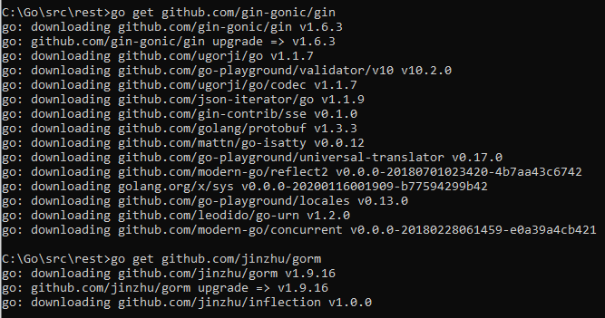

<h1>Gin RESTful API</h1>
<h3>Install Gin</h3>

<h3>Berikut source codenya</h3>
Buat koneksi Ke database

```package main

import (
	"github.com/jinzhu/gorm"
	"github.com/gin-gonic/gin"
	_ "github.com/jinzhu/gorm/dialects/mysql"
	"net/http"
)

var db *gorm.DB

func init() {
	var err error
	db, err =
		gorm.Open("mysql", "root:welcome1@tcp(127.0.0.1:3306)/golang?charset=utf8&parseTime=True&loc=Local")
	if err != nil {
		panic("Gagal Conect Ke Database")
	}
	db.AutoMigrate(&student{})
}
```
<br>
Selanjutnya buat model nya untuk olah datanya. kalau di golang namanya adalah struct
kodingannya sebagai berikut:
```type (
	student struct {
		gorm.Model
		Nama        string `json:"nama"`
		Alamat      string `json:"alamat"`
		NoHp        string `json:"no_hp"`
		Kelas       string `json:"kelas"`
		StatusAktif int    `json:"status_aktif"`
	}
	transformedStudent struct {
		ID          uint   `json:"id"`
		Nama        string `json:"nama"`
		Alamat      string `json:"alamat"`
		NoHp        string `json:"no_hp"`
		Kelas       string `json:"kelas"`
		StatusAktif bool   `json:"status_aktif"`
	}
)
```
<br>
Selanjutnya  buat function untuk Create nya. Kodingannya sebagai berikut :
```func cretedStudent(c *gin.Context) {
	var std transformedStudent
	var model student
	c.Bind(&std)
	validasi := validatorCreated(std)
	model = transferVoToModel(std)
	if validasi != "" {
		c.JSON(http.StatusOK, gin.H{"message": http.StatusOK, "result": validasi})
	} else {
		db.Create(&model)
		c.JSON(http.StatusOK, gin.H{"message": http.StatusOK, "result": model})
	}
}
```
<br>
Selajutnya membuat function get All berikut kodinganya:
```func fetchAllStudent(c *gin.Context) {
	var model [] student
	var vo [] transformedStudent

	db.Find(&model)

	if len(model) <= 0 {
		c.JSON(http.StatusNotFound, gin.H{"message": http.StatusNotFound, "result": "Data Tidak Ada"})
	}

	for _, item := range model {
		vo = append(vo, transferModelToVo(item))
	}
	c.JSON(http.StatusOK, gin.H{"message": http.StatusOK, "result": vo})
}
```

<br>
Selanjutnya membuat function get Detail berikut kodinganya:
```func fetchSingleStuden(c *gin.Context) {
	var model student
	var vo transformedStudent

	modelID := c.Param("id")
	db.Find(&model, modelID)

	if model.ID == 0 {
		c.JSON(http.StatusNotFound, gin.H{"message": http.StatusNotFound, "result": "Data Tidak Ada"})
	}
	vo = transferModelToVo(model)
	c.JSON(http.StatusOK, gin.H{"message": http.StatusOK, "result": vo})
}
```
<br>
Selanjutnya membuat function update berikut kodinganya :
```func updateStudent(c *gin.Context) {
	var model student
	var vo transformedStudent
	modelID := c.Param("id")
	db.First(&model, modelID)

	if model.ID == 0 {
		c.JSON(http.StatusNotFound, gin.H{"message": http.StatusNotFound, "result": "Data Tidak Ada"})
	}
	c.Bind(&vo)

	validasi := validatorCreated(vo)
	if validasi != "" {
		c.JSON(http.StatusOK, gin.H{"message": http.StatusOK, "result": validasi})
	} else {
		db.Model(&model).Update(transferVoToModel(vo))
		c.JSON(http.StatusOK, gin.H{"message": http.StatusOK, "result": model})
	}
}
```
<br>
Selanjutnya buat function delete berikut kodinganya:
```func deleteStudent(c *gin.Context) {
	var model student
	modelID := c.Param("id")

	db.First(&model, modelID)
	if model.ID == 0 {
		c.JSON(http.StatusNotFound, gin.H{"message": http.StatusNotFound, "result": "Datat Tidak di Temukan"})
	}
	db.Delete(model)
	c.JSON(http.StatusOK, gin.H{"message": http.StatusOK, "result": "Data Telah berhasil di hapus"})
}
```
<br>
Selanjutnya buat routernya untuk mengases semua function melalui REST HTTP berikut kodinganya:
```func main() {

	router := gin.Default()
	v1 := router.Group("/api/student")
	{
		v1.POST("", cretedStudent)
		v1.GET("", fetchAllStudent)
		v1.GET("/:id", fetchSingleStuden)
		v1.PUT("/:id", updateStudent)
		v1.DELETE("/:id", deleteStudent)
	}
	router.Run(":20001")
}
```