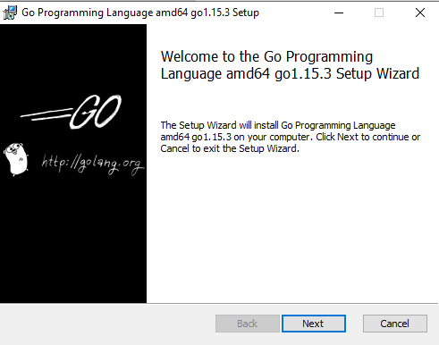
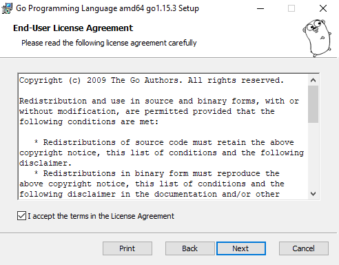
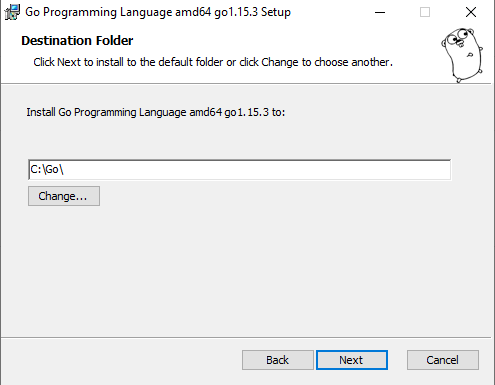
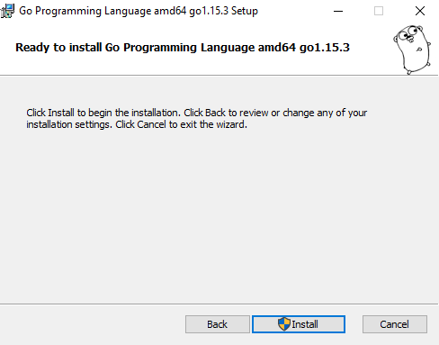
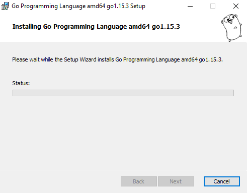
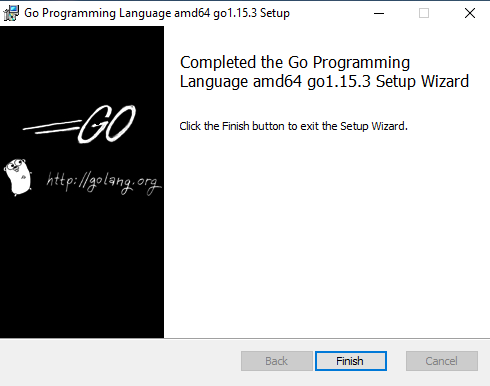
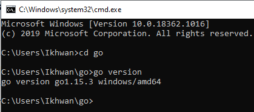

<h1>Go Language</h1>
Go adalah bahasa pemrograman sumber terbuka yang memudahkan pembuatan perangkat lunak yang sederhana, andal, dan efisien.
<h1>Install Go Language</h1>
Berikut langkah langkahnya : 
<ol>
<li>Download installernya terlebih dahulu di golang.org</li>
<li>Setelah didownload, jalankan installernya</li>

<li>Kemudian klik next, pahami ketentuan lisensinya, lalu centang
"I accept the terms in the License Agreement"</li>

<li>Pilih lokasi direktori yang hendak dipakai Golang</li>

<li>Golang sudah siap diinstall, namun pastikan dulu settingan sebelumnya
jika ada yang ingin diubah masih dapat kembali, jika tidak ada klik Install</li>

<li>Mohon ditunggu, saat ini sedang proses penginstallan</li>

<li>Bahasa Pemrograman GO saat ini sudah terinstall</li>

<li>Pengecekan versi golang di CMD</li>

</ol>
<h1>Melihat data dengan Golang dan MySQL</h1>
<ol>
<li>Membuat folder untuk mengerjakan project</li>
<li>Install driver mysql untuk golang</li>
<li>Buka terminal MySQL, kemudian membuat database serta table, kemudian isi datanya</li>
<li>Buat program dengan ekstensi .go di folder project yang sudah dibuat</li>
<li>Jalankan program</li>

</ol>