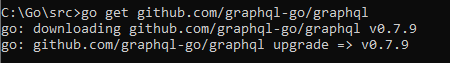

<h1>graphql</h1>
<h3>Getting Started</h3>
To install the library, run:

The following is a simple example which defines a schema with a single hello string-type field and a Resolve method which returns the string world. A GraphQL query is performed against this schema with the resulting output printed in JSON format.

```package main

import (
	"encoding/json"
	"fmt"
	"log"

	"github.com/graphql-go/graphql"
)

func main() {
	// Schema
	fields := graphql.Fields{
		"hello": &graphql.Field{
			Type: graphql.String,
			Resolve: func(p graphql.ResolveParams) (interface{}, error) {
				return "world", nil
			},
		},
	}
	rootQuery := graphql.ObjectConfig{Name: "RootQuery", Fields: fields}
	schemaConfig := graphql.SchemaConfig{Query: graphql.NewObject(rootQuery)}
	schema, err := graphql.NewSchema(schemaConfig)
	if err != nil {
		log.Fatalf("failed to create new schema, error: %v", err)
	}

	// Query
	query := `
		{
			hello
		}
	`
	params := graphql.Params{Schema: schema, RequestString: query}
	r := graphql.Do(params)
	if len(r.Errors) > 0 {
		log.Fatalf("failed to execute graphql operation, errors: %+v", r.Errors)
	}
	rJSON, _ := json.Marshal(r)
	fmt.Printf("%s \n", rJSON) // {"data":{"hello":"world"}}
}
```