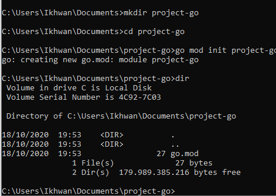
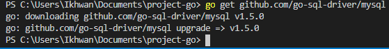
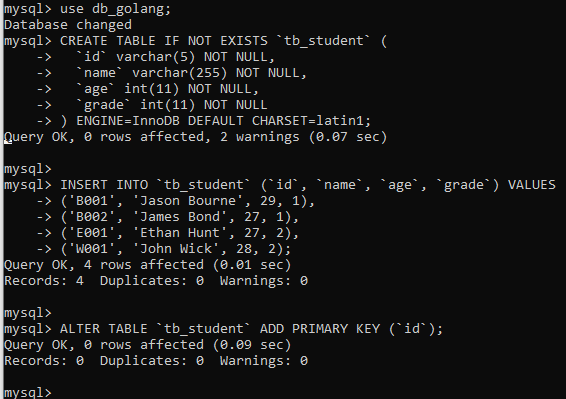
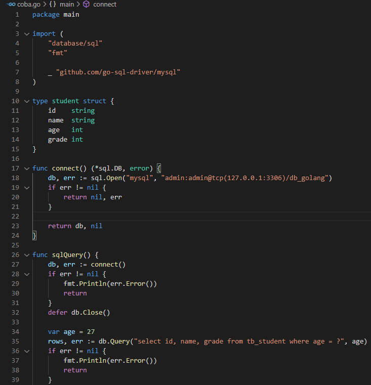
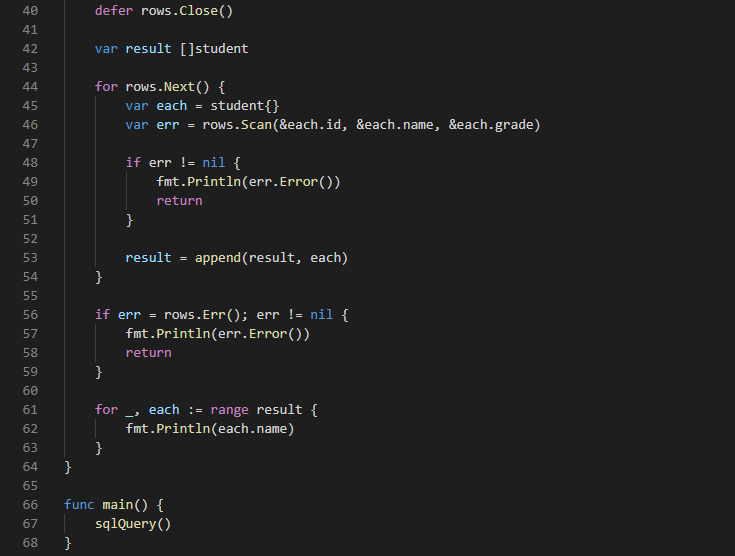
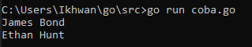

<h1>Melihat data dengan Golang dan MySQL</h1>
<ol>
<li>Membuat folder untuk mengerjakan project</li>

<li>Install driver mysql untuk golang</li>

<li>Buka terminal MySQL, kemudian membuat database serta table, kemudian isi datanya</li>

<li>Buat program dengan ekstensi .go di folder project yang sudah dibuat</li>

<li>Jalankan program</li>

</ol>