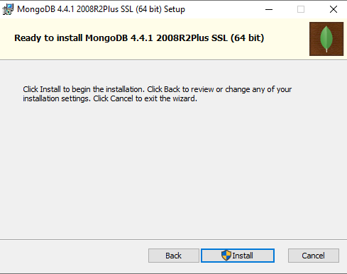

<h1>MongoDB</h1>
MongoDB adalah program database berorientasi dokumen lintas platform. Diklasifikasikan sebagai program database NoSQL, MongoDB menggunakan dokumen seperti JSON dengan skema opsional. MongoDB dikembangkan oleh MongoDB Inc. dan dilisensikan di bawah Lisensi Publik Sisi Server.
<h1>Install MongoDB</h1>
Berikut langkah langkahnya : 
<ol>
<li>Download installernya di https://www.mongodb.com/try/download/community</li>
<li>Jalankan installernya, kemudian klik next</li>

<li>Pahami ketentuan lisensinya, kemudian centang "I accept the terms in the License Agreement", klik next</li>

<li>Pilih fitur program apa saja yang akan install, atau pilih mode complete</li>

<li>setting MongoDB sebagai service windows atau tidak, serta lokasi service yang akan diisi oleh MongoDB</li>

<li>Install MongoDB Compass, jika memerlukan.</li>

<li>MongoDB sudah siap diinstall, jika ada settingan yang dirubah, masih bisa klik kembali, jika sudah yakin, klik Install</li>

<li>Proses install</li>

<li>MongoDB sudah terinstall</li>

</ol>