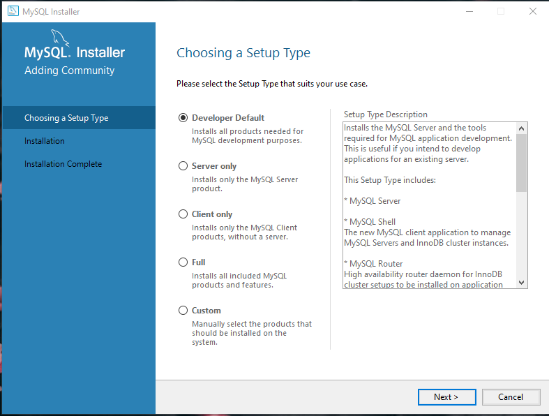

<h1>MySQL Commmunity</h1>
<h1>Install MySQL Commmunity</h1>
Berikut langkah langkahnya : 
<ol>
<li>Download MySQL Community di https://dev.mysql.com/downloads/</li>
<li>Setelah didownload, jalankan installernya, kemudian pilih tipe MySQL apa yang akan diinstall</li>

<li>Lengkapi requirements yang diperlukan untuk MySQL, seperti Microsoft Visual C++ 2019</li>

<li>Proses penginstallan</li>

<li>Konfigurasi Tipe dan Jaringan<li>

<li>Kemudian pilih mode authentikasi, pilih yang direkomendasikan oleh sistem</li>

<li>Kemudian mengisi password untuk akun root</li>

<li>Kemudian setting MySQL jika dipilih sebagai windows service</li>

<li>Proses konfig sudah selesai, MySQL sudah dapat dijalankan</li>

</ol>