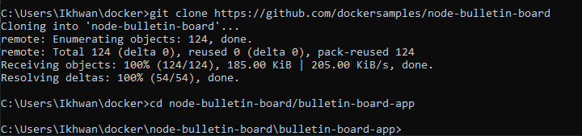
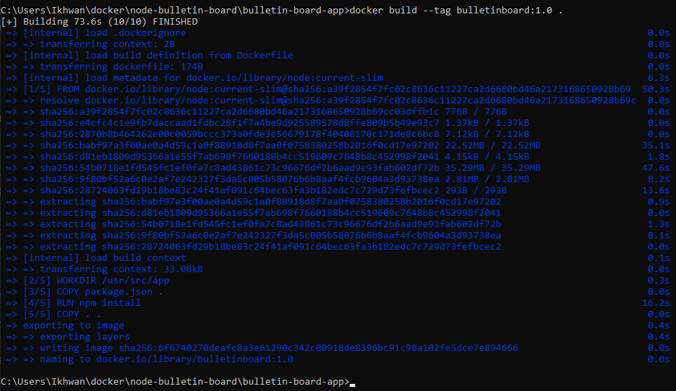
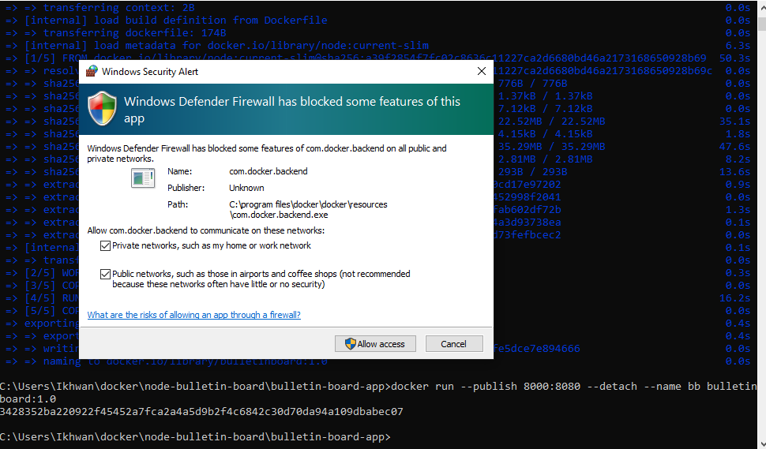
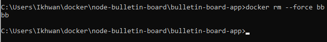

<h1>Bangun dan jalankan image</h1>
<h3>mempersiapkan</h3>
Unduh proyek contoh node-bulletin-board. Ini adalah aplikasi papan buletin sederhana yang ditulis dalam Node.js.
<h3>Git</h3>
Clone proyek contoh dari GitHub:

<h3>Tentukan container dengan Dockerfile</h3>
Setelah mengunduh proyek, lihat file bernama Dockerfile di aplikasi papan buletin. Dockerfiles menjelaskan cara merakit sistem file privat untuk sebuah kontainer, dan juga bisa berisi beberapa metadata yang menjelaskan bagaimana menjalankan sebuah kontainer berdasarkan image ini.
<h3>Buat dan uji image</h3>
Sekarang setelah memiliki beberapa kode sumber dan Dockerfile, sekarang saatnya membuat image, dan pastikan container yang diluncurkan darinya berfungsi seperti yang diharapkan.

Pastikan berada di direktori node-bulletin-board / bulletin-board-app di terminal atau PowerShell menggunakan perintah cd. Jalankan perintah berikut untuk membuat gambar papan buletin:

<h3>Jalankan image sebagai container</h3>
<ul>
<li>Jalankan perintah berikut untuk memulai container berdasarkan image:</li>

<li>Kunjungi aplikasi di browser di localhost: 8000. User biasanya akan memastikan container berfungsi seperti yang diharapkan.</li>

<li>Setelah yakin bahwa container papan buletin berfungsi dengan benar, User dapat menghapusnya:</li>

</ul>