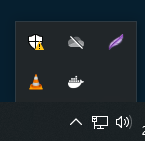

<h1>Install Docker Desktop di Windows</h1>
Docker Desktop untuk Windows adalah versi Komunitas dari Docker untuk Microsoft Windows.
 
Halaman ini berisi informasi tentang menginstal Docker Desktop di Windows 10 Pro, Enterprise, dan Education
<h3>Persyaratan sistem</h3>
Mesin Windows 10 harus memenuhi persyaratan berikut untuk menginstal Docker Desktop:
<ul>
<li>Windows 10 64-bit: Pro, Enterprise, or Education (Build 16299 or later).</li>
<li>Fitur Hyper-V dan Container Windows harus diaktifkan.</li>
<li>Prasyarat perangkat keras berikut diperlukan untuk berhasil menjalankan Klien Hyper-V di Windows 10:</li>
<ul>
<li>Prosesor 64 bit dengan Second Level Address Translation (SLAT)</li>
<li>4GB system RAM</li>
<li>Dukungan virtualisasi perangkat keras tingkat BIOS harus diaktifkan di pengaturan BIOS.</li>
</ul>
<li>Unduh dan instal paket pembaruan kernel Linux.</li>
</ul>

<h3>Instal Docker Desktop di Windows</h3>
<ol>	
<li>Klik dua kali Docker Desktop Installer.exe untuk menjalankan penginstal.</li>

<li>Saat diminta, pastikan opsi Aktifkan Fitur Hyper-V Windows dipilih di halaman Konfigurasi.</li>

<li>Ikuti petunjuk di wizard penginstalan, otorisasi penginstal dan lanjutkan penginstalan.</li>
<li>Jika penginstalan berhasil, klik Tutup untuk menyelesaikan proses penginstalan.</li>
</ol>

<h3>Mulai Desktop Docker</h3>
Docker Desktop tidak dimulai secara otomatis setelah penginstalan. Untuk memulai Desktop Docker, cari Docker, dan pilih Desktop Docker di hasil pencarian. 
 
Saat ikon ikan paus di bilah status tetap stabil, Desktop Docker sedang aktif dan dapat diakses dari jendela terminal mana pun. 
 
Saat inisialisasi selesai, Docker Desktop meluncurkan tutorial. Tutorial ini menyertakan latihan sederhana untuk membuat contoh image Docker, menjalankannya sebagai container, mendorong dan menyimpan image ke Docker Hub.
<ul>
<li>Mulai Tutorial</li>

<li>Clone sebuah repository</li>

<li>Buat Image</li>

<li>Jalankan Container</li>

<li>Buka localhost di browser</li>

</ul>

