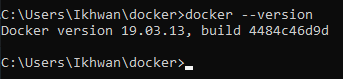
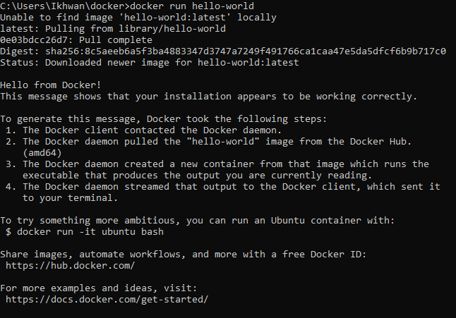
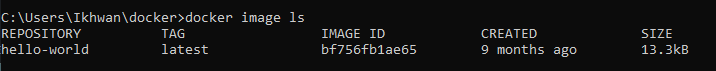
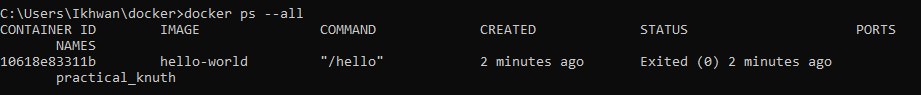

<h3>Uji versi Docker</h1>
Setelah berhasil menginstal Docker Desktop, buka terminal dan jalankan docker --version untuk memeriksa versi Docker yang diinstal pada mesin. 
 
<h3>Uji penginstalan Docker</h3>
<ul>
<li>Uji apakah penginstalan Anda berfungsi dengan menjalankan image Docker hello-world:</li>

<li>Jalankan docker image ls untuk membuat daftar image hello-world yang sudah diunduh.</li>

<li>Cantumkan docker hello-world (yang dihasilkan oleh gamuimagebar) yang keluar setelah menampilkan pesannya. Jika masih berjalan, Anda tidak memerlukan opsi --all:</li>

</ul>

