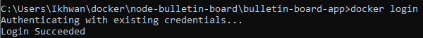
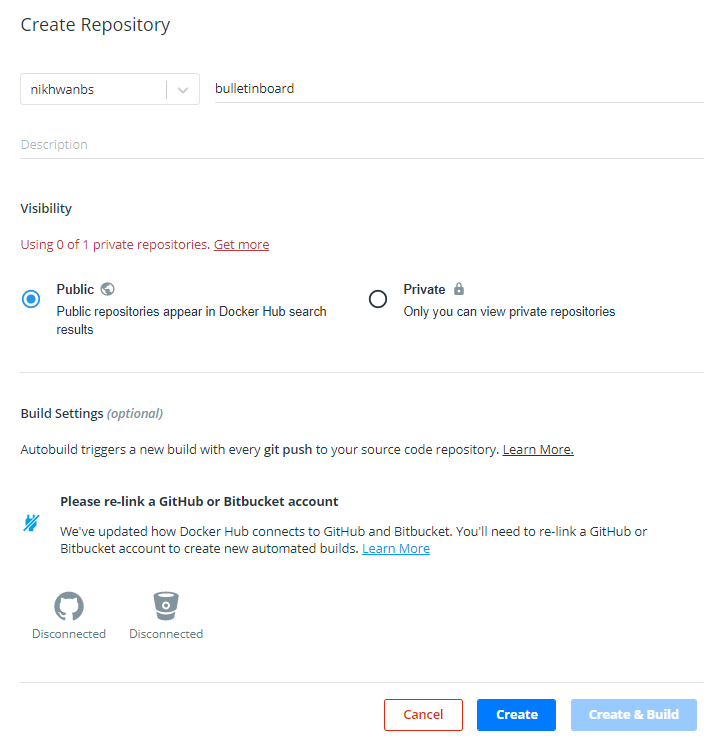
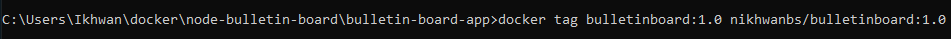
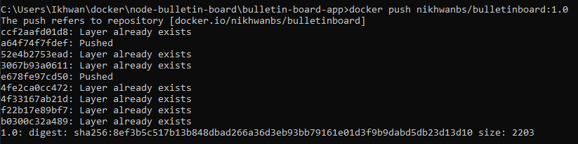
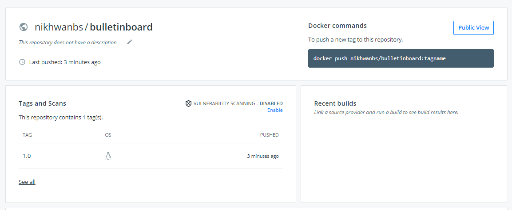

<h1>Bagikan images di Docker Hub</h1>
<h3>Siapkan akun Docker Hub Anda</h3>
Jika Anda tidak memiliki ID Docker, ikuti langkah-langkah berikut untuk membuatnya. ID Docker memungkinkan Anda untuk berbagi gambar di Docker Hub.
<ul>
<li>Kunjungi halaman pendaftaran Docker Hub.</li>

<li>Isi formulir dan kirim untuk membuat ID Docker Anda.</li>

<li>Verifikasi alamat email Anda untuk menyelesaikan proses pendaftaran.</li>

<li>Klik ikon Docker di bilah alat atau baki sistem Anda, dan klik Masuk / Buat ID Docker.</li>

<li>Isi ID Docker dan kata sandi baru Anda. Setelah Anda berhasil mengautentikasi, ID Docker Anda muncul di menu Desktop Docker menggantikan opsi 'Masuk' yang baru saja Anda gunakan.</li>
</ul>
Anda juga dapat masuk ke Docker Hub dari baris perintah dengan mengetik docker login

<h3>Buat repositori Docker Hub dan push image Anda</h3>
Sekarang mari buat repositori pertama Anda, dan dorong gambar papan buletin Anda ke Docker Hub.
<ul>
<li>Klik pada ikon Docker di bilah menu Anda, dan arahkan ke Repositories> Buat. Anda akan diarahkan ke halaman Buat Repositori di Docker Hub.</li>
<li>Ketik nama repositori sebagai bulletinboard dan klik Buat di bagian bawah halaman. Jangan isi detail lainnya untuk saat ini.</li>

<li>Anda sekarang siap untuk membagikan image Anda di Docker Hub, namun, ada satu hal yang harus Anda lakukan terlebih dahulu: image harus diberi spasi dengan benar untuk dibagikan di Docker Hub. Secara khusus, Anda harus memberi nama gambar seperti <Your Docker ID>/<Repository Name>:<tag>.

Pastikan Anda berada di direktori node-bulletin-board / bulletin-board-app di terminal atau PowerShell, lalu jalankan:
</li>

<li>Terakhir, dorong image Anda ke Docker Hub:</li>\

</ul>
Kunjungi repositori Anda di Docker Hub, dan Anda akan melihat image baru Anda di sana. Ingat, repositori Docker Hub bersifat publik secara default.
