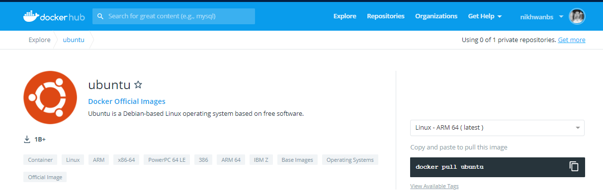
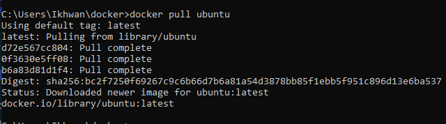
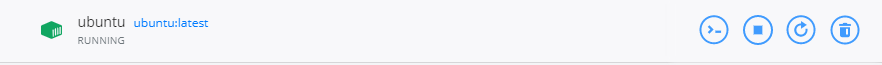
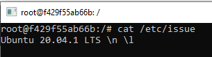

<h1>Tugas</h1>
Mencoba pull image ubuntu di docker
<ul>
<li>Cari image di docker hub, contohnya ubuntu</li>

<li>Kemudian pull dengan perintah:</li>

<li>Jalankan image</li>

<li>Akan muncul terminal baru, yang nantinya dapat digunakan seperti terminal di sistem operasi Ubuntu</li>

</ul>