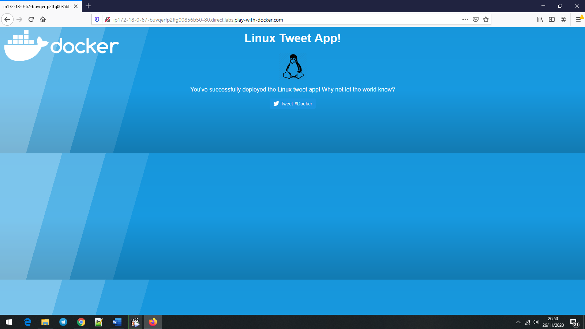
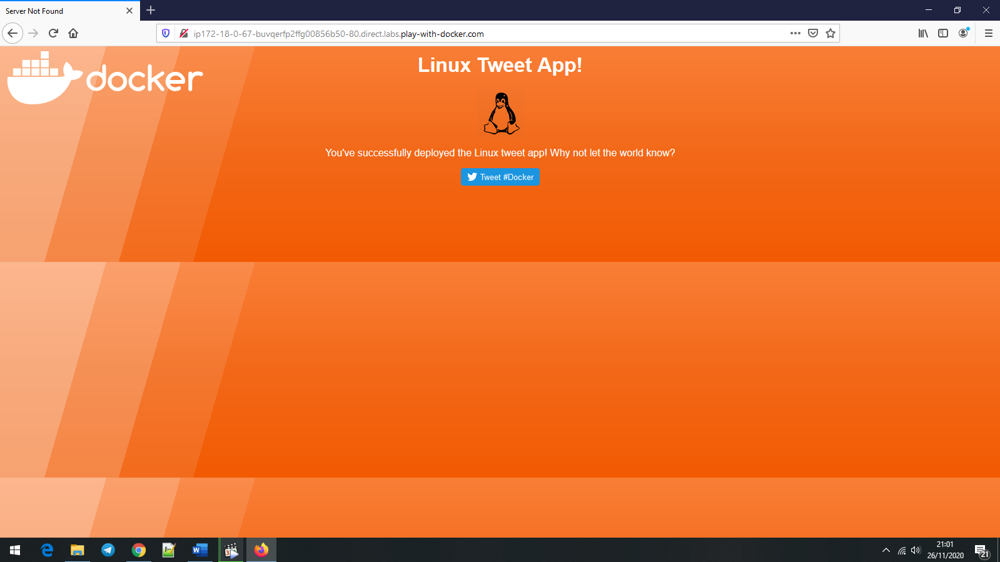
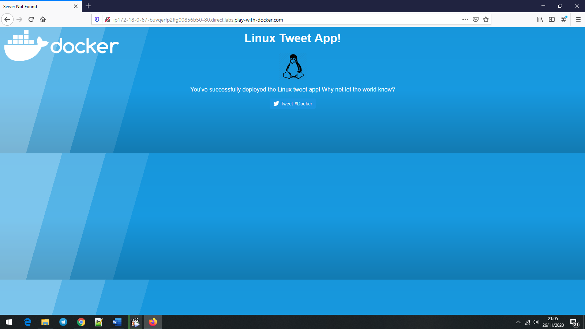
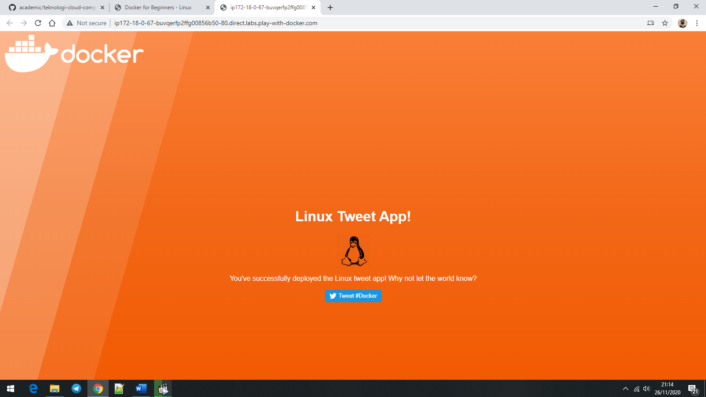
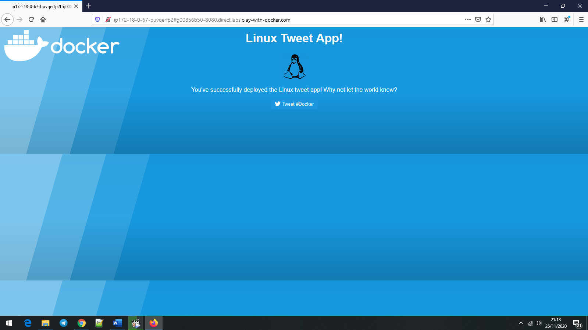
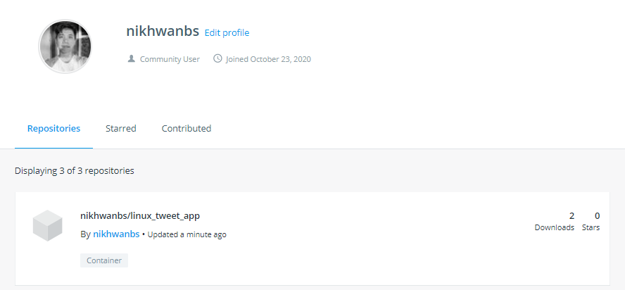

# Docker for Beginners - Linux
## Task 0: Prerequisites

Clone the Lab’s GitHub Repo

```console
[node1] (local) root@192.168.0.28 ~
$     git clone https://github.com/dockersamples/linux_tweet_app
Cloning into 'linux_tweet_app'...
remote: Enumerating objects: 14, done.
remote: Total 14 (delta 0), reused 0 (delta 0), pack-reused 14
Receiving objects: 100% (14/14), 10.76 KiB | 10.76 MiB/s, done.
Resolving deltas: 100% (5/5), done.
```

## Task 1: Run some simple Docker containers
### Run a single task in an Alpine Linux container
In this step we’re going to start a new container and tell it to run the hostname command. The container will start, execute the hostname command, then exit.

1. Run the following command in your Linux console.

    ```console
    $  docker container run alpine hostname
    Unable to find image 'alpine:latest' locally
    latest: Pulling from library/alpine
    188c0c94c7c5: Pull complete
    Digest: sha256:c0e9560cda118f9ec63ddefb4a173a2b2a0347082d7dff7dc14272e7841a5b5a
    Status: Downloaded newer image for alpine:latest
    c523ee190124
    ```

2. Docker keeps a container running as long as the process it started inside the container is still running. In this case the hostname process exits as soon as the output is written. This means the container stops. However, Docker doesn’t delete resources by default, so the container still exists in the Exited state.

List all containers.
    ```console
    $  docker container ls --all
    CONTAINER ID        IMAGE               COMMAND             CREATED             STATUS                     PORTS               NAMES
    c523ee190124        alpine              "hostname"          2 minutes ago       Exited (0) 2 minutes ago                       cool_goodall
    ```
### Run an interactive Ubuntu container
You can run a container based on a different version of Linux than is running on your Docker host.

In the next example, we are going to run an Ubuntu Linux container on top of an Alpine Linux Docker host (Play With Docker uses Alpine Linux for its nodes).
1. Run a Docker container and access its shell.
    ```console
    $  docker container run --interactive --tty --rm ubuntu bash
    Unable to find image 'ubuntu:latest' locally
    latest: Pulling from library/ubuntu
    da7391352a9b: Pull complete
    14428a6d4bcd: Pull complete
    2c2d948710f2: Pull complete
    Digest: sha256:c95a8e48bf88e9849f3e0f723d9f49fa12c5a00cfc6e60d2bc99d87555295e4c
    Status: Downloaded newer image for ubuntu:latest
    root@8e7e8f6ab89f:/#
    ```

2. Run the following commands in the container.
    ls / will list the contents of the root director in the container, ps aux will show running processes in the container, cat /etc/issue will show which Linux distro the container is running.
    ```console
    root@8e7e8f6ab89f:/# ls /
    bin   dev  home  lib32  libx32  mnt  proc  run   srv  tmp  var
    boot  etc  lib   lib64  media   opt  root  sbin  sys  usr
    root@8e7e8f6ab89f:/# ps aux
    USER        PID %CPU %MEM    VSZ   RSS TTY      STAT START   TIME COMMAND
    root          1  0.3  0.0   4108  2252 pts/0    Ss   13:11   0:00 bash
    root          9  0.0  0.0   5896  2804 pts/0    R+   13:13   0:00 ps aux
    root@8e7e8f6ab89f:/# cat /etc/issue
    Ubuntu 20.04.1 LTS \n \l
    ```

3. Type exit to leave the shell session. This will terminate the bash process, causing the container to exit.
    ```console
    root@8e7e8f6ab89f:/#  exit
    exit
    ```

4. For fun, let’s check the version of our host VM.
    ```console
    $  cat /etc/issue
    Welcome to Alpine Linux 3.12
    Kernel \r on an \m (\l)
    ```

### Run a background MySQL container
Background containers are how you’ll run most applications. Here’s a simple example using MySQL.

1. Run a new MySQL container with the following command.
    ```console
    $  docker container run \
    >  --detach \
    >  --name mydb \
    >  -e MYSQL_ROOT_PASSWORD=my-secret-pw \
    >  mysql:latest
    Unable to find image 'mysql:latest' locally
    latest: Pulling from library/mysql
    852e50cd189d: Pull complete
    29969ddb0ffb: Pull complete
    a43f41a44c48: Pull complete
    5cdd802543a3: Pull complete
    b79b040de953: Pull complete
    938c64119969: Pull complete
    7689ec51a0d9: Pull complete
    a880ba7c411f: Pull complete
    984f656ec6ca: Pull complete
    9f497bce458a: Pull complete
    b9940f97694b: Pull complete
    2f069358dc96: Pull complete
    Digest: sha256:4bb2e81a40e9d0d59bd8e3dc2ba5e1f2197696f6de39a91e90798dd27299b093
    Status: Downloaded newer image for mysql:latest
    93660354a88d82e0f28c3e50e945d9fc239343b2b1d9cd2a9a39a91add16212c
    ```
    As long as the MySQL process is running, Docker will keep the container running in the background.

2. List the running containers.
    ```console
    $  docker container ls
    CONTAINER ID        IMAGE               COMMAND                  CREATED             STATUS        PORTS                 NAMES
    93660354a88d        mysql:latest        "docker-entrypoint.s…"   2 minutes ago       Up 2 minutes        3306/tcp, 33060/tcp   mydb
    ```

3. You can check what’s happening in your containers by using a couple of built-in Docker commands: docker container logs and docker container top.
    ```console
    <output truncated>
   2017-09-29T16:02:58.605004Z 0 [Note] Executing 'SELECT * FROM INFORMATION_SCHEMA.TABLES;' to get a list of tables using the deprecated partition engine. You may use the startup option '--disable-partition-engine-check' to skip this check.
   2017-09-29T16:02:58.605026Z 0 [Note] Beginning of list of non-natively partitioned tables
   2017-09-29T16:02:58.616575Z 0 [Note] End of list of non-natively partitioned tables
    ```

    Let’s look at the processes running inside the container.
    ```console
    $    docker container top mydb
    PID                 USER                TIME                COMMAND
    2023                999                 0:00                {docker-entrypoi} /bin/bash/usr/local/bin/docker-entrypoint.sh mysqld
    2235                999                 0:05                mysqld --daemonize --skip-networking --socket=/var/run/mysqld/mysqld.sock
    2339                999                 0:00                mysql_tzinfo_to_sql /usr/share/zoneinfo
    2340                999                 0:00                sed s/Local time zone must be set--see zic manual page/FCTY/
    2351                999                 0:00                {docker-entrypoi} /bin/bash/usr/local/bin/docker-entrypoint.sh mysqld
    2353                999                 0:00                mysql --defaults-extra-file=/dev/fd/63 --protocol=socket -uroot -hlocalhost --socket=/var/run/mysqld/mysqld.sock --database=mysql
    ```

4. List the MySQL version using docker container exec
    docker container exec allows you to run a command inside a container. In this example, we’ll use docker container exec to run the command-line equivalent of mysql --user=root --password=$MYSQL_ROOT_PASSWORD --version inside our MySQL container.
    ```console
    docker exec -it mydb \
    mysql --user=root --password=$MYSQL_ROOT_PASSWORD --version
    mysql: [Warning] Using a password on the command line interface can be insecure.
    mysql  Ver 14.14 Distrib 5.7.19, for Linux (x86_64) using  EditLine wrapper
    ```

5. You can also use docker container exec to connect to a new shell process inside an already-running container. Executing the command below will give you an interactive shell (sh) inside your MySQL container.
    ```console
    $  docker exec -it mydb sh
    #
    ```

6. Let’s check the version number by running the same command again, only this time from within the new shell session in the container.
    ```console
    #  mysql --user=root --password=$MYSQL_ROOT_PASSWORD --version
    mysql: [Warning] Using a password on the command line interface can be insecure.
    mysql  Ver 8.0.22 for Linux on x86_64 (MySQL Community Server - GPL)
    ```

7. Type exit to leave the interactive shell session.
    ```console
    #  exit
    ```

## Task 2: Package and run a custom app using Docker
In this step you’ll learn how to package your own apps as Docker images using a Dockerfile.

The Dockerfile syntax is straightforward. In this task, we’re going to create a simple NGINX website from a Dockerfile.

### Build a simple website image
Let’s have a look at the Dockerfile we’ll be using, which builds a simple website that allows you to send a tweet.

1. Make sure you’re in the linux_tweet_app directory.
    ```console
    $  cd ~/linux_tweet_app
    [node1] (local) root@192.168.0.28 ~/linux_tweet_app
    ```

2. Display the contents of the Dockerfile.
    ```console
    $  cat Dockerfile
    FROM nginx:latest

    COPY index.html /usr/share/nginx/html
    COPY linux.png /usr/share/nginx/html

    EXPOSE 80 443

    CMD ["nginx", "-g", "daemon off;"]
    ```
    Let’s see what each of these lines in the Dockerfile do.

    - FROM specifies the base image to use as the starting point for this new image you’re creating. For this example we’re starting from nginx:latest.
    - COPY copies files from the Docker host into the image, at a known location. In this example, COPY is used to copy two files into the image: index.html. and a graphic that will be used on our webpage.
    - EXPOSE documents which ports the application uses.
    - CMD specifies what command to run when a container is started from the image. Notice that we can specify the command, as well as run-time arguments.

3. In order to make the following commands more copy/paste friendly, export an environment variable containing your     DockerID
    ```console
    $ export DOCKERID=nikhwanbs
    ```

4. Echo the value of the variable back to the terminal to ensure it was stored correctly.
    ```console 
    $  echo $DOCKERID
    nikhwanbs
    ```

5. Use the docker image build command to create a new Docker image using the instructions in the Dockerfile.
    - --tag allows us to give the image a custom name. In this case it’s comprised of our DockerID, the application name, and a version. Having the Docker ID attached to the name will allow us to store it on Docker Hub in a later step
    - . tells Docker to use the current directory as the build context\
    ```console
    $  docker image build --tag $DOCKERID/linux_tweet_app:1.0 .
    Sending build context to Docker daemon  92.16kB
    Step 1/5 : FROM nginx:latest
    latest: Pulling from library/nginx
    852e50cd189d: Already exists
    571d7e852307: Pull complete
    addb10abd9cb: Pull complete
    d20aa7ccdb77: Pull complete
    8b03f1e11359: Pull complete
    Digest: sha256:6b1daa9462046581ac15be20277a7c75476283f969cb3a61c8725ec38d3b01c3
    Status: Downloaded newer image for nginx:latest
    ---> bc9a0695f571
    Step 2/5 : COPY index.html /usr/share/nginx/html
    ---> d7e066878cfd
    Step 3/5 : COPY linux.png /usr/share/nginx/html
    ---> e429bd2273ab
    Step 4/5 : EXPOSE 80 443
    ---> Running in e833f551fabd
    Removing intermediate container e833f551fabd
    ---> be9b968f3f32
    Step 5/5 : CMD ["nginx", "-g", "daemon off;"]
    ---> Running in b963f11de875
    Removing intermediate container b963f11de875
    ---> 08b90741add3
    Successfully built 08b90741add3
    Successfully tagged nikhwanbs/linux_tweet_app:1.0
    ```

6. Use the docker container run command to start a new container from the image you created.
    As this container will be running an NGINX web server, we’ll use the --publish flag to publish port 80 inside the container onto port 80 on the host. This will allow traffic coming in to the Docker host on port 80 to be directed to port 80 in the container. The format of the --publish flag is host_port:container_port.
    ```console
    $  docker container run \
    >  --detach \
    >  --publish 80:80 \
    >  --name linux_tweet_app \
    >  $DOCKERID/linux_tweet_app:1.0
    5882752c146db98d44b09ab1b75fe312262be5af2312bff51ea77ebb4f73d6bd
    ```
    Any external traffic coming into the server on port 80 will now be directed into the container on port 80.

7. Load the website which should be running.
    

8. Once you’ve accessed your website, shut it down and remove it.
    ```console
    $  docker container rm --force linux_tweet_app
    linux_tweet_app
    [node1] (local) root@192.168.0.28 ~/linux_tweet_app
    ```

## Task 3: Modify a running website
When you’re actively working on an application it is inconvenient to have to stop the container, rebuild the image, and run a new version every time you make a change to your source code.

One way to streamline this process is to mount the source code directory on the local machine into the running container. This will allow any changes made to the files on the host to be immediately reflected in the container.

We do this using something called a bind mount.

When you use a bind mount, a file or directory on the host machine is mounted into a container running on the same host.

### Start our web app with a bind mount
1. Let’s start the web app and mount the current directory into the container.
    Be sure to run this command from within the linux_tweet_app directory on your Docker host.
    ```console
    $  docker container run \
    >  --detach \
    >  --publish 80:80 \
    >  --name linux_tweet_app \
    >  --mount type=bind,source="$(pwd)",target=/usr/share/nginx/html \
    >  $DOCKERID/linux_tweet_app:1.0
    c0881aed7570929e4288425e2546ec3a4474a5ba9b39defcd2a2f51b134ed86e
    ```
2. The website should be running.
    

### Modify the running website
Bind mounts mean that any changes made to the local file system are immediately reflected in the running container.
1. Copy a new index.html into the container.
    ```console
    $  cp index-new.html index.html
    ```

2. Go to the running website and refresh the page. Notice that the site has changed.
    

Even though we’ve modified the index.html local filesystem and seen it reflected in the running container, we’ve not actually changed the Docker image that the container was started from.
To show this, stop the current container and re-run the 1.0 image without a bind mount.

1. Stop and remove the currently running container.
    ```console
    $  docker rm --force linux_tweet_app
    linux_tweet_app

    ```
2. Rerun the current version without a bind mount.
    ```console
    [node1] (local) root@192.168.0.28 ~/linux_tweet_app
    $  docker container run \
    >  --detach \
    >  --publish 80:80 \
    >  --name linux_tweet_app \
    >  $DOCKERID/linux_tweet_app:1.0
    db1c27c09ec2633fcfb8cfa76dde3794c867be30dc75fd8597a7b3795a8af36a

    ```
3. Notice the website is back to the original version.
    

4. Stop and remove the current container
    ```console
    $  docker rm --force linux_tweet_app
    ```

### Update the image
To persist the changes you made to the index.html file into the image, you need to build a new version of the image.

1. Build a new image and tag it as 2.0
    ```console
    $  docker image build --tag $DOCKERID/linux_tweet_app:2.0 .
    Sending build context to Docker daemon  92.16kB
    Step 1/5 : FROM nginx:latest
    ---> bc9a0695f571
    Step 2/5 : COPY index.html /usr/share/nginx/html
    ---> 1828d1a40373
    Step 3/5 : COPY linux.png /usr/share/nginx/html
    ---> 456464f76942
    Step 4/5 : EXPOSE 80 443
    ---> Running in 39879a9a2bdf
    Removing intermediate container 39879a9a2bdf
    ---> f52d5ea2b753
    Step 5/5 : CMD ["nginx", "-g", "daemon off;"]
    ---> Running in 254af5aa589a
    Removing intermediate container 254af5aa589a
    ---> 6ae7130ec9f4
    Successfully built 6ae7130ec9f4
    Successfully tagged nikhwanbs/linux_tweet_app:2.0
    [node1] (local) root@192.168.0.28 ~/linux_tweet_app
    $
    ```
    Notice how fast that built! This is because Docker only modified the portion of the image that changed vs. rebuilding the whole image.

2. Let’s look at the images on the system.
    ```console
    $  docker image ls
    REPOSITORY                  TAG                 IMAGE ID            CREATED SIZE
    nikhwanbs/linux_tweet_app   2.0                 6ae7130ec9f4        About a minute ago 133MB
    nikhwanbs/linux_tweet_app   1.0                 08b90741add3        36 minutes ago 133MB
    ubuntu                      latest              f643c72bc252        16 hours ago 72.9MB
    nginx                       latest              bc9a0695f571        38 hours ago 133MB
    mysql                       latest              dd7265748b5d        5 days ago 545MB
    alpine                      latest              d6e46aa2470d        5 weeks ago 5.57MB
    ```

### Test the new version

1. Run a new container from the new version of the image.
    ```console
    $  docker container run \
    >  --detach \
    >  --publish 80:80 \
    >  --name linux_tweet_app \
    >  $DOCKERID/linux_tweet_app:2.0
    f150c3f2043806ec407171f6d3275e2e680488c839a3780e2139bf52ddd6b32d
    ```

2. Check the new version of the website 
The web page will have an orange background.

We can run both versions side by side. The only thing we need to be aware of is that we cannot have two containers using port 80 on the same host.

As we’re already using port 80 for the container running from the 2.0 version of the image, we will start a new container and publish it on port 8080. Additionally, we need to give our container a unique name (old_linux_tweet_app)
    

3. Run another new container, this time from the old version of the image.
Notice that this command maps the new container to port 8080 on the host. This is because two containers cannot map to the same port on a single Docker host.
    ```console
    $  docker container run \
    >  --detach \
    >  --publish 8080:80 \
    >  --name old_linux_tweet_app \
    >  $DOCKERID/linux_tweet_app:1.0
    09d7b1642f557f81304d4a0d66286035eed827e908008b381e5f0af9f223e583
    ```

4. View the old version of the website.
    

### Push your images to Docker Hub

1. List the images on your Docker host
    ```console
    $  docker image ls -f reference="$DOCKERID/*"
    REPOSITORY                  TAG                 IMAGE ID            CREATEDSIZE
    nikhwanbs/linux_tweet_app   2.0                 6ae7130ec9f4        9 minutes ago133MB
    nikhwanbs/linux_tweet_app   1.0                 08b90741add3        43 minutes ago133MB
    ```

2. Before you can push your images, you will need to log into Docker Hub.
    ```console
    $  docker login
    Login with your Docker ID to push and pull images from Docker Hub. If you don't have a Docker ID, head over to https://hub.docker.com to create one.
    Username: nikhwanbs
    Password:
    WARNING! Your password will be stored unencrypted in /root/.docker/config.json.
    Configure a credential helper to remove this warning. See
    https://docs.docker.com/engine/reference/commandline/login/#credentials-store

    Login Succeeded
    ```

3. Push version 1.0 of your web app using docker image push.
    ```console
    $  docker image push $DOCKERID/linux_tweet_app:1.0
    The push refers to repository [docker.io/nikhwanbs/linux_tweet_app]
    34d902e01b89: Pushed
    e945a5ac1ea1: Pushed
    7e914612e366: Mounted from library/nginx
    f790aed835ee: Mounted from library/nginx
    850c2400ea4d: Mounted from library/nginx
    7ccabd267c9f: Mounted from library/nginx
    f5600c6330da: Mounted from library/nginx
    1.0: digest: sha256:e10203b83b9992784836357259b51efb113dcdcf3b67eb65bbae59bef9c29414 size: 1777
    ```

4. Now push version 2.0.
    ```console
    $  docker image push $DOCKERID/linux_tweet_app:2.0
    The push refers to repository [docker.io/nikhwanbs/linux_tweet_app]
    3746c1dce670: Pushed
    8a4999e57e27: Pushed
    7e914612e366: Layer already exists
    f790aed835ee: Layer already exists
    850c2400ea4d: Layer already exists
    7ccabd267c9f: Layer already exists
    f5600c6330da: Layer already exists
    2.0: digest: sha256:4559ab4446712282d99170332d7090d0b0a3241b347c8dfa1c2f22975bd273ce size: 1777
    ```

You can browse to https://hub.docker.com/r/<your docker id>/ and see your newly-pushed Docker images. These are public repositories, so anyone can pull the image - you don’t even need a Docker ID to pull public images. Docker Hub also supports private repositories.
