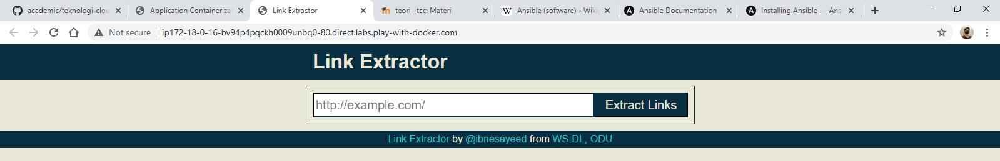
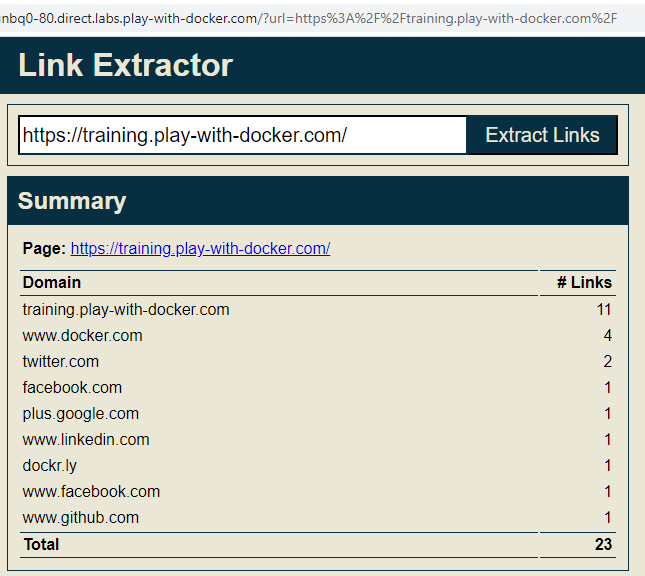
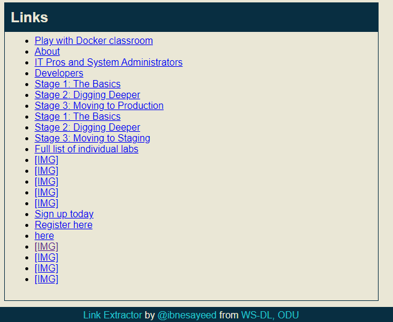
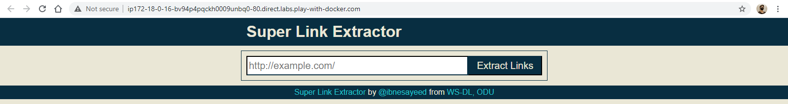
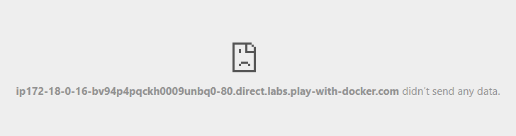

# PRAKTIKUM 11 Application Containerization and Microservice Orchestration

In this tutorial we will learn about basic application containerization using Docker and running various components of an application as microservices. We will utilize Docker Compose for orchestration during the development. This tutorial is targeted for beginners who have the basic familiarity with Docker.

## Stage Setup
Let’s get started by first cloning the demo code repository, changing the working directory, and checking the demo branch out.
```terminal
$ git clone https://github.com/ibnesayeed/linkextractor.git
Cloning into 'linkextractor'...
remote: Enumerating objects: 4, done.
remote: Counting objects: 100% (4/4), done.
remote: Compressing objects: 100% (4/4), done.
remote: Total 144 (delta 0), reused 0 (delta 0), pack-reused 140
Receiving objects: 100% (144/144), 44.55 KiB | 6.36 MiB/s, done.
Resolving deltas: 100% (43/43), done.
[node1] (local) root@192.168.0.13 ~
$ cd linkextractor
[node1] (local) root@192.168.0.13 ~/linkextractor
$ git checkout demo
Branch 'demo' set up to track remote branch 'demo' from 'origin'.
Switched to a new branch 'demo'
```

## Step 0: Basic Link Extractor Script
Checkout the step0 branch and list files in it.
```terminal
$ git checkout step0
$ tree
.
├── README.md
└── linkextractor.py

0 directories, 2 files
```

The linkextractor.py file is the interesting one here, so let’s look at its contents:
```terminal
$ cat linkextractor.py
#!/usr/bin/env python

import sys
import requests
from bs4 import BeautifulSoup

res = requests.get(sys.argv[-1])
soup = BeautifulSoup(res.text, "html.parser")
for link in soup.find_all("a"):
    print(link.get("href"))
```

However, this seemingly simple script might not be the easiest one to run on a machine that does not meet its requirements. The README.md file suggests how to run it, so let’s give it a try:
```terminal
$ ./linkextractor.py http://example.com/
bash: ./linkextractor.py: Permission denied
```

When we tried to execute it as a script, we got the Permission denied error. Let’s check the current permissions on this file:
```terminal
$ ls -l linkextractor.py
-rw-r--r--    1 root     root           220 Sep 23 16:26 linkextractor.py
```

This current permission -rw-r--r-- indicates that the script is not set to be executable. We can either change it by running chmod a+x linkextractor.py or run it as a Python program instead of a self-executing script as illustrated below:
```terminal
$ python linkextractor.py
Traceback (most recent call last):
  File "linkextractor.py", line 5, in <module>
    from bs4 import BeautifulSoup
ImportError: No module named bs4
```

Here we got the first ImportError message because we are missing the third-party package needed by the script. We can install that Python package (and potentially other missing packages) using one of the many techniques to make it work, but it is too much work for such a simple script, which might not be obvious for those who are not familiar with Python’s ecosystem.


## Step 1: Containerized Link Extractor Script
Checkout the step1 branch and list files in it.
```terminal
$ git checkout step1
Branch 'step1' set up to track remote branch 'step1' from 'origin'.
Switched to a new branch 'step1'

$ tree
.
├── Dockerfile
├── README.md
└── linkextractor.py

0 directories, 3 files
```

We have added one new file (i.e., Dockerfile) in this step. Let’s look into its contents:
```terminal
$ cat Dockerfile
FROM       python:3
LABEL      maintainer="Sawood Alam <@ibnesayeed>"

RUN        pip install beautifulsoup4
RUN        pip install requests

WORKDIR    /app
COPY       linkextractor.py /app/
RUN        chmod a+x linkextractor.py

ENTRYPOINT ["./linkextractor.py"]
```

So far, we have just described how we want our Docker image to be like, but didn’t really build one. So let’s do just that:
```terminal
$ docker image build -t linkextractor:step1 .
Sending build context to Docker daemon  107.5kB
Step 1/8 : FROM       python:3
3: Pulling from library/python
...
Successfully built cc8e1f7e4939
Successfully tagged linkextractor:step1
```

We have created a Docker image named linkextractor:step1 based on the Dockerfile illustrated above. If the build was successful, we should be able to see it in the list of image:
```terminal
$ docker image ls
REPOSITORY      TAG       IMAGE ID       CREATED              SIZE
linkextractor   step1     cc8e1f7e4939   About a minute ago   894MB
python          3         a879e610c533   2 days ago           885MB

```
This image should have all the necessary ingredients packaged in it to run the script anywhere on a machine that supports Docker. Now, let’s run a one-off container with this image and extract links from some live web pages:
```terminal
$ docker container run -it --rm linkextractor:step1 http://example.com/
https://www.iana.org/domains/example
```

This outputs a single link that is present in the simple example.com web page:
http://www.iana.org/domains/example

Let’s try it on a web page with more links in it:
```terminal
$ docker container run -it --rm linkextractor:step1 https://training.play-with-docker.com/
/
/about/
#ops
#dev
/ops-stage1
/ops-stage2
/ops-stage3
/dev-stage1
/dev-stage2
/dev-stage3
/alacart
https://twitter.com/intent/tweet?text=Play with Docker Classroom&url=https://training.play-with-docker.com/&via=docker&related=docker
https://facebook.com/sharer.php?u=https://training.play-with-docker.com/
https://plus.google.com/share?url=https://training.play-with-docker.com/
http://www.linkedin.com/shareArticle?mini=true&url=https://training.play-with-docker.com/&title=Play%20with%20Docker%20Classroom&source=https://training.play-with-docker.com
https://2018.dockercon.com/
https://2018.dockercon.com/
https://success.docker.com/training/
https://community.docker.com/registrations/groups/4316
https://docker.com
https://www.docker.com
```

This looks good, but we can improve the output. For example, some links are relative, we can convert them into full URLs and also provide the anchor text they are linked to. In the next step we will make these changes and some other improvements to the script.

## Step 2: Link Extractor Module with Full URI and Anchor Text
Checkout the step2 branch and list files in it.
```terminal
$ git checkout step2
$ tree
.
├── Dockerfile
├── README.md
└── linkextractor.py

0 directories, 3 files
```

Let’s have a look at the updated script:
```terminal
$ cat linkextractor.py
#!/usr/bin/env python

import sys
import requests
from bs4 import BeautifulSoup
from urllib.parse import urljoin

def extract_links(url):
    res = requests.get(url)
    soup = BeautifulSoup(res.text, "html.parser")
    base = url
    # TODO: Update base if a <base> element is present with the href attribute
    links = []
    for link in soup.find_all("a"):
        links.append({
            "text": " ".join(link.text.split()) or "[IMG]",
            "href": urljoin(base, link.get("href"))
        })
    return links

if __name__ == "__main__":
    if len(sys.argv) != 2:
        print("\nUsage:\n\t{} <URL>\n".format(sys.argv[0]))
        sys.exit(1)
    for link in extract_links(sys.argv[-1]):
        print("[{}]({})".format(link["text"], link["href"]))
```
The link extraction logic is abstracted into a function extract_links that accepts a URL as a parameter and returns a list of objects containing anchor texts and normalized hyperlinks. This functionality can now be imported into other scripts as a module (which we will utilize in the next step).

Now, let’s build a new image and see these changes in effect:
```terminal
$ docker image build -t linkextractor:step2 .
Sending build context to Docker daemon  110.1kB
Step 1/8 : FROM       python:3
 ---> a879e610c533
Step 2/8 : LABEL      maintainer="Sawood Alam <@ibnesayeed>"
 ---> Using cache
 ---> 316d2b75ff33
Step 3/8 : RUN        pip install beautifulsoup4
 ---> Using cache
 ---> 4c3adb0ea677
Step 4/8 : RUN        pip install requests
 ---> Using cache
 ---> 9420af6beea0
Step 5/8 : WORKDIR    /app
 ---> Using cache
 ---> 0373d209fea0
Step 6/8 : COPY       linkextractor.py /app/
 ---> cbd194bbac78
Step 7/8 : RUN        chmod a+x linkextractor.py
 ---> Running in a182ad259dc4
Removing intermediate container a182ad259dc4
 ---> b2fd5bcf7043
Step 8/8 : ENTRYPOINT ["./linkextractor.py"]
 ---> Running in 0ff4c9efd79c
Removing intermediate container 0ff4c9efd79c
 ---> f72f88bfd538
Successfully built f72f88bfd538
Successfully tagged linkextractor:step2
```

We have used a new tag linkextractor:step2 for this image so that we don’t overwrite the image from the step0 to illustrate that they can co-exist and containers can be run using either of these images.
```terminal
$ docker image ls
REPOSITORY      TAG       IMAGE ID       CREATED          SIZE
linkextractor   step2     f72f88bfd538   24 seconds ago   894MB
linkextractor   step1     cc8e1f7e4939   6 minutes ago    894MB
python          3         a879e610c533   2 days ago       885MB
```

Running a one-off container using the linkextractor:step2 image should now yield an improved output:
```terminal
$ docker container run -it --rm linkextractor:step2 https://training.play-with-docker.com/
[Play with Docker classroom](https://training.play-with-docker.com/)
[About](https://training.play-with-docker.com/about/)
[IT Pros and System Administrators](https://training.play-with-docker.com/#ops)
[Developers](https://training.play-with-docker.com/#dev)
[Stage 1: The Basics](https://training.play-with-docker.com/ops-stage1)
[Stage 2: Digging Deeper](https://training.play-with-docker.com/ops-stage2)
[Stage 3: Moving to Production](https://training.play-with-docker.com/ops-stage3)
[Stage 1: The Basics](https://training.play-with-docker.com/dev-stage1)
[Stage 2: Digging Deeper](https://training.play-with-docker.com/dev-stage2)
[Stage 3: Moving to Staging](https://training.play-with-docker.com/dev-stage3)
[Full list of individual labs](https://training.play-with-docker.com/alacart)
[[IMG]](https://twitter.com/intent/tweet?text=Play with Docker Classroom&url=https://training.play-with-docker.com/&via=docker&related=docker)
[[IMG]](https://facebook.com/sharer.php?u=https://training.play-with-docker.com/)
[[IMG]](https://plus.google.com/share?url=https://training.play-with-docker.com/)
[[IMG]](http://www.linkedin.com/shareArticle?mini=true&url=https://training.play-with-docker.com/&title=Play%20with%20Docker%20Classroom&source=https://training.play-with-docker.com)
[[IMG]](https://www.docker.com/dockercon/)
[Sign up today](https://www.docker.com/dockercon/)
[Register here](https://dockr.ly/slack)
[here](https://www.docker.com/legal/docker-terms-service)
[[IMG]](https://www.docker.com)
[[IMG]](https://www.facebook.com/docker.run)
[[IMG]](https://twitter.com/docker)
[[IMG]](https://www.github.com/play-with-docker/play-with-docker.github.io)
```

Running a container using the previous image linkextractor:step1 should still result in the old output:
```terminal
$ docker container run -it --rm linkextractor:step1 https://training.play-with-docker.com/
/
/about/
#ops
#dev
/ops-stage1
/ops-stage2
/ops-stage3
/dev-stage1
/dev-stage2
/dev-stage3
/alacart
https://twitter.com/intent/tweet?text=Play with Docker Classroom&url=https://training.play-with-docker.com/&via=docker&related=docker
https://facebook.com/sharer.php?u=https://training.play-with-docker.com/
https://plus.google.com/share?url=https://training.play-with-docker.com/
http://www.linkedin.com/shareArticle?mini=true&url=https://training.play-with-docker.com/&title=Play%20with%20Docker%20Classroom&source=https://training.play-with-docker.com
https://www.docker.com/dockercon/
https://www.docker.com/dockercon/
https://dockr.ly/slack
https://www.docker.com/legal/docker-terms-service
https://www.docker.com
https://www.facebook.com/docker.run
https://twitter.com/docker
https://www.github.com/play-with-docker/play-with-docker.github.io

```

## Step 3: Link Extractor API Service
Checkout the step3 branch and list files in it.
```terminal
$ git checkout step3
$ tree
.
├── Dockerfile
├── README.md
├── linkextractor.py
├── main.py
└── requirements.txt

0 directories, 5 files
```

Let’s first look at the Dockerfile for changes:
```terminal
$ cat Dockerfile
FROM       python:3
LABEL      maintainer="Sawood Alam <@ibnesayeed>"

WORKDIR    /app
COPY       requirements.txt /app/
RUN        pip install -r requirements.txt

COPY       *.py /app/
RUN        chmod a+x *.py

CMD        ["./main.py"]
```

Since we have started using requirements.txt for dependencies, we no longer need to run pip install command for individual packages. The ENTRYPOINT directive is replaced with the CMD and it is referring to the main.py script that has the server code it because we do not want to use this image for one-off commands now.

The linkextractor.py module remains unchanged in this step, so let’s look into the newly added main.py file:
```terminal
$ cat main.py
#!/usr/bin/env python

from flask import Flask
from flask import request
from flask import jsonify
from linkextractor import extract_links

app = Flask(__name__)

@app.route("/")
def index():
    return "Usage: http://<hostname>[:<prt>]/api/<url>"

@app.route("/api/<path:url>")
def api(url):
    qs = request.query_string.decode("utf-8")
    if qs != "":
        url += "?" + qs
    links = extract_links(url)
    return jsonify(links)

app.run(host="0.0.0.0")
```

Here, we are importing extract_links function from the linkextractor module and converting the returned list of objects into a JSON response.
[RIGHT HERE]
It’s time to build a new image with these changes in place:
```terminal
$ docker image build -t linkextractor:step3 .
Sending build context to Docker daemon  115.7kB
Step 1/8 : FROM       python:3
 ---> a879e610c533
…
Successfully built 8b50ee692b64
Successfully tagged linkextractor:step3
```

Then run the container in detached mode (-d flag) so that the terminal is available for other commands while the container is still running. Note that we are mapping the port 5000 of the container with the 5000 of the host (using -p 5000:5000 argument) to make it accessible from the host. We are also assigning a name (--name=linkextractor) to the container to make it easier to see logs and kill or remove the container.

```terminal
$ docker container run -d -p 5000:5000 --name=linkextractor linkextractor:step3
5cec7fecd1285375c6bf9479fc3fc446efca4b4ec29287b77a87b7d226420c81
```

If things go well, we should be able to see the container being listed in Up condition:
```terminal
$ docker container ls
CONTAINER ID   IMAGE                 COMMAND       CREATED          STATUSPORTS                    NAMES
5cec7fecd128   linkextractor:step3   "./main.py"   17 seconds ago   Up 16 seconds0.0.0.0:5000->5000/tcp   linkextractor
```

We can now make an HTTP request in the form /api/<url> to talk to this server and fetch the response containing extracted links:
```terminal
$ curl -i http://localhost:5000/api/http://example.com/
HTTP/1.0 200 OK
Content-Type: application/json
Content-Length: 79
Server: Werkzeug/1.0.1 Python/3.9.1
Date: Thu, 10 Dec 2020 16:55:31 GMT

[{"href":"https://www.iana.org/domains/example","text":"More information..."}]
```

Now, we have the API service running that accepts requests in the form /api/<url> and responds with a JSON containing hyperlinks and anchor texts of all the links present in the web page at give <url>.

Since the container is running in detached mode, so we can’t see what’s happening inside, but we can see logs using the name linkextractor we assigned to our container:
```terminal
$ docker container logs linkextractor
 * Serving Flask app "main" (lazy loading)
 * Environment: production
   WARNING: This is a development server. Do not use it in a production deployment.
   Use a production WSGI server instead.
 * Debug mode: off
 * Running on http://0.0.0.0:5000/ (Press CTRL+C to quit)
172.17.0.1 - - [10/Dec/2020 16:55:31] "GET /api/http://example.com/ HTTP/1.1" 200 –
```

We can see the messages logged when the server came up, and an entry of the request log when we ran the curl command. Now we can kill and remove this container:
```terminal
$ docker container rm -f linkextractor
linkextractor
```

In this step we have successfully ran an API service listening on port 5000. This is great, but APIs and JSON responses are for machines, so in the next step we will run a web service with a human-friendly web interface in addition to this API service.

## Step 4: Link Extractor API and Web Front End Services
Checkout the step4 branch and list files in it.
```terminal
$ git checkout step4
$ tree
.
├── README.md
├── api
│   ├── Dockerfile
│   ├── linkextractor.py
│   ├── main.py
│   └── requirements.txt
├── docker-compose.yml
└── www
    └── index.php

2 directories, 7 files
```

In this step we are planning to run two separate containers, one for the API and the other for the web interface. The latter needs a way to talk to the API server. For the two containers to be able to talk to each other, we can either map their ports on the host machine and use that for request routing or we can place the containers in a single private network and access directly. Docker has an excellent support of networking and provides helpful commands to deal with networks. Additionally, in a Docker network containers identify themselves using their names as hostnames to avoid hunting for their IP addresses in the private network. However, we are not going to do any of this manually, instead we will be using Docker Compose to automate many of these tasks.

So let’s look at the docker-compose.yml file we have:
```terminal
$ cat docker-compose.yml
version: '3'

services:
  api:
    image: linkextractor-api:step4-python
    build: ./api
    ports:
      - "5000:5000"
  web:
    image: php:7-apache
    ports:
      - "80:80"
    environment:
      - API_ENDPOINT=http://api:5000/api/
    volumes:
      - ./www:/var/www/html
```

This is a simple YAML file that describes the two services api and web. The api service will use the linkextractor-api:step4-python image that is not built yet, but will be built on-demand using the Dockerfile from the ./api directory. This service will be exposed on the port 5000 of the host.

The second service named web will use official php:7-apache image directly from the DockerHub, that’s why we do not have a Dockerfile for it. The service will be exposed on the default HTTP port (i.e., 80). We will supply an environment variable named API_ENDPOINT with the value http://api:5000/api/ to tell the PHP script where to connect to for the API access. Notice that we are not using an IP address here, instead, api:5000 is being used because we will have a dynamic hostname entry in the private network for the API service matching its service name. Finally, we will bind mount the ./www folder to make the index.php file available inside of the web service container at /var/www/html, which is the default web root for the Apache web server.

Now, let’s have a look at the user-facing www/index.php file:
```terminal
$ cat www/index.php
$api_endpoint = $_ENV["API_ENDPOINT"] ?: "http://localhost:5000/api/";
$url = "";
if(isset($_GET["url"]) && $_GET["url"] != "") {
  $url = $_GET["url"];
  $json = @file_get_contents($api_endpoint . $url);
  if($json == false) {
    $err = "Something is wrong with the URL: " . $url;
  } else {
    $links = json_decode($json, true);
    $domains = [];
    foreach($links as $link) {
      array_push($domains, parse_url($link["href"], PHP_URL_HOST));
    }
    $domainct = @array_count_values($domains);
    arsort($domainct);
  }
}
```

Let’s bring these services up in detached mode using docker-compose utility:
```terminal
$ docker-compose up -d --build
Creating network "linkextractor_default" with the default driver
Building api
Step 1/8 : FROM       python:3
 ---> a879e610c533
... [OUTPUT REDACTED] ...
Successfully built f17e4bbc67f7
Successfully tagged linkextractor-api:step4-python
Pulling web (php:7-apache)...
7-apache: Pulling from library/php
852e50cd189d: Pull complete
0266fc315b01: Pull complete
4c8a5fa787a1: Pull complete
46fc127c1884: Pull complete
f768b7fadf16: Pull complete
345b578c1a78: Pull complete
90aafe41e78d: Pull complete
0b5d7691301b: Pull complete
e06cc2d9e2f8: Pull complete
6e9815fb33e7: Pull complete
9c620d71744c: Pull complete
66ef24dcaca4: Pull complete
83f52dab9487: Pull complete
Digest: sha256:1d57ff0a8318dcbde0bc5ec3f7aaa617920f3c7ebe7ffb331876609c8392b18a
Status: Downloaded newer image for php:7-apache
Creating linkextractor_api_1 ... done
Creating linkextractor_web_1 ... done
```

Checking for the list of running containers confirms that the two services are indeed running:
```terminal
$ docker container ls
CONTAINER ID   IMAGE                            COMMAND                  CREATED          STATUS              PORTS                    NAMES
2f2b7a436b4d   php:7-apache                     "docker-php-entrypoi…"   About a minute ago   Up About a minute   0.0.0.0:80->80/tcp       linkextractor_web_1
72d460979744   linkextractor-api:step4-python   "./main.py"              About a minute ago   Up About a minute   0.0.0.0:5000->5000/tcp   linkextractor_api_1
```

We should now be able to talk to the API service as before:
```terminal
$ curl -i http://localhost:5000/api/http://example.com/
HTTP/1.0 200 OK
Content-Type: application/json
Content-Length: 79
Server: Werkzeug/1.0.1 Python/3.9.1
Date: Thu, 10 Dec 2020 17:04:32 GMT

[{"href":"https://www.iana.org/domains/example","text":"More information..."}]
```



ENTERLINKS https://training.play-with-docker.com/




Now, let’s modify the www/index.php file to replace all occurrences of Link Extractor with Super Link Extractor:
```terminal
$ sed -i 's/Link Extractor/Super Link Extractor/g' www/index.php
```



Reloading the web interface of the application (or clicking here) should now reflect this change in the title, header, and footer. This is happening because the ./www folder is bind mounted inside of the container, so any changes made outside will reflect inside the container or the vice versa. This approach is very helpful in development, but in the production environment we would prefer our Docker images to be self-contained. Let’s revert these changes now to clean the Git tracking:
```terminal
$ git reset --hard
HEAD is now at 2a3ec3e Synchronize branch step4
```

Before we move on to the next step we need to shut these services down, but Docker Compose can help us take care of it very easily:
```terminal
$ docker-compose down
Stopping linkextractor_api_1 ... done
Stopping linkextractor_web_1 ... done
Removing linkextractor_api_1 ... done
Removing linkextractor_web_1 ... done
Removing network linkextractor_default
```
In the next step we will add one more service to our stack and will build a self-contained custom image for our web interface service.

## Step 5: Redis Service for Caching
Checkout the step5 branch and list files in it.
```terminal
$ git checkout step5
$ tree
.
├── README.md
├── api
│   ├── Dockerfile
│   ├── linkextractor.py
│   ├── main.py
│   └── requirements.txt
├── docker-compose.yml
└── www
    ├── Dockerfile
    └── index.php

2 directories, 8 files
```

Let’s first inspect the newly added Dockerfile under the ./www folder:
```terminal
$ cat www/Dockerfile
FROM       php:7-apache
LABEL      maintainer="Sawood Alam <@ibnesayeed>"

ENV        API_ENDPOINT="http://localhost:5000/api/"

COPY       . /var/www/html/
```

This is a rather simple Dockerfile that uses the official php:7-apache image as the base and copies all the files from the ./www folder into the /var/www/html/ folder of the image. This is exactly what was happening in the previous step, but that was bind mounted using a volume, while here we are making the code part of the self-contained image. We have also added the API_ENDPOINT environment variable here with a default value, which implicitly suggests that this is an important information that needs to be present in order for the service to function properly (and should be customized at run time with an appropriate value).

Next, we will look at the API server’s api/main.py file where we are utilizing the Redis cache:
```terminal
$ cat api/main.py
#!/usr/bin/env python

import os
import json
import redis
from flask import Flask
from flask import request
from linkextractor import extract_links

app = Flask(__name__)
redis_conn = redis.from_url(os.getenv("REDIS_URL", "redis://localhost:6379"))

@app.route("/")
def index():
    return "Usage: http://<hostname>[:<prt>]/api/<url>"

@app.route("/api/<path:url>")
def api(url):
    qs = request.query_string.decode("utf-8")
    if qs != "":
        url += "?" + qs

    jsonlinks = redis_conn.get(url)
    if not jsonlinks:
        links = extract_links(url)
        jsonlinks = json.dumps(links, indent=2)
        redis_conn.set(url, jsonlinks)

    response = app.response_class(
        status=200,
        mimetype="application/json",
        response=jsonlinks
    )

    return response

app.run(host="0.0.0.0")
```

Now, let’s look into the updated docker-compose.yml file:
```terminal
$ cat docker-compose.yml
version: '3'

services:
  api:
    image: linkextractor-api:step5-python
    build: ./api
    ports:
      - "5000:5000"
    environment:
      - REDIS_URL=redis://redis:6379
  web:
    image: linkextractor-web:step5-php
    build: ./www
    ports:
      - "80:80"
    environment:
      - API_ENDPOINT=http://api:5000/api/
  redis:
    image: redis
```

Let’s boot these services up:
```terminal
$ docker-compose up -d --build
Creating network "linkextractor_default" with the default driver
Building api
Step 1/9 : FROM       python:3
…
Successfully built ce7ed2bbf38d
Successfully tagged linkextractor-web:step5-php
Pulling redis (redis:)...
latest: Pulling from library/redis
852e50cd189d: Already exists
76190fa64fb8: Pull complete
9cbb1b61e01b: Pull complete
d048021f2aae: Pull complete
6f4b2af24926: Pull complete
1cf1d6922fba: Pull complete
Digest: sha256:5b98e32b58cdbf9f6b6f77072c4915d5ebec43912114031f37fa5fa25b032489
Status: Downloaded newer image for redis:latest
Creating linkextractor_web_1   ... done
Creating linkextractor_api_1   ... done
Creating linkextractor_redis_1 ... done
```

Now, that all three services are up, access the web interface by visiting the Link Extractor. There should be no visual difference from the previous step. However, if you extract links from a page with a lot of links, the first time it should take longer, but the successive attempts to the same page should return the response fairly quickly. To check whether or not the Redis service is being utilized, we can use docker-compose exec followed by the redis service name and the Redis CLI’s monitor command:
```terminal
$ docker-compose exec redis redis-cli monitor
OK
```

Now, try to extract links from some web pages using the web interface and see the difference in Redis log entries for pages that are scraped the first time and those that are repeated. Before continuing further with the tutorial, stop the interactive monitor stream as a result of the above redis-cli command by pressing Ctrl + C keys while the interactive terminal is in focus.

Now that we are not mounting the /www folder inside the container, local changes should not reflect in the running service:
```terminal
$ sed -i 's/Link Extractor/Super Link Extractor/g' www/index.php
```

Verify that the changes made locally do not reflect in the running service by reloading the web interface and then revert changes:
```terminal
$ git reset --hard
HEAD is now at 3dbb7eb Synchronize branch step5
```

Now, shut these services down and get ready for the next step:
```terminal
$ docker-compose down
Stopping linkextractor_api_1   ... done
Stopping linkextractor_redis_1 ... done
Stopping linkextractor_web_1   ... done
Removing linkextractor_api_1   ... done
Removing linkextractor_redis_1 ... done
Removing linkextractor_web_1   ... done
Removing network linkextractor_default
```

We have successfully orchestrated three microservices to compose our Link Extractor application. We now have an application stack that represents the architecture illustrated in the figure shown in the introduction of this tutorial. In the next step we will explore how easy it is to swap components from an application with the microservice architecture.

## Step 6: Swap Python API Service with Ruby
Checkout the step6 branch and list files in it.
```terminal
$ tree
.
├── README.md
├── api
│   ├── Dockerfile
│   ├── Gemfile
│   └── linkextractor.rb
├── docker-compose.yml
├── logs
└── www
    ├── Dockerfile
    └── index.php

3 directories, 7 files
```

Let’s have a quick walk through the changed files:
```terminal
$ cat api/linkextractor.rb
#!/usr/bin/env ruby
# encoding: utf-8

require "sinatra"
require "open-uri"
require "uri"
require "nokogiri"
require "json"
require "redis"

set :protection, :except=>:path_traversal

redis = Redis.new(url: ENV["REDIS_URL"] || "redis://localhost:6379")

Dir.mkdir("logs") unless Dir.exist?("logs")
cache_log = File.new("logs/extraction.log", "a")

get "/" do
  "Usage: http://<hostname>[:<prt>]/api/<url>"
end

get "/api/*" do
  url = [params['splat'].first, request.query_string].reject(&:empty?).join("?")
  cache_status = "HIT"
  jsonlinks = redis.get(url)
  if jsonlinks.nil?
    cache_status = "MISS"
    jsonlinks = JSON.pretty_generate(extract_links(url))
    redis.set(url, jsonlinks)
  end

  cache_log.puts "#{Time.now.to_i}\t#{cache_status}\t#{url}"

  status 200
  headers "content-type" => "application/json"
  body jsonlinks
end

def extract_links(url)
  links = []
  doc = Nokogiri::HTML(open(url))
  doc.css("a").each do |link|
    text = link.text.strip.split.join(" ")
    begin
      links.push({
        text: text.empty? ? "[IMG]" : text,
        href: URI.join(url, link["href"])
      })
    rescue
    end
  end
  links
end
```

This Ruby file is almost equivalent to what we had in Python before, except, in addition to that it also logs the link extraction requests and corresponding cache events. In a microservice architecture application swapping components with an equivalent one is easy as long as the expectations of consumers of the component are maintained.
```terminal
$ cat api/Dockerfile
FROM       ruby:2.6
LABEL      maintainer="Sawood Alam <@ibnesayeed>"

ENV        LANG C.UTF-8
ENV        REDIS_URL="redis://localhost:6379"

WORKDIR    /app
COPY       Gemfile /app/
RUN        bundle install

COPY       linkextractor.rb /app/
RUN        chmod a+x linkextractor.rb

CMD        ["./linkextractor.rb", "-o", "0.0.0.0"]
```

Above Dockerfile is written for the Ruby script and it is pretty much self-explanatory.
```terminal
$ cat docker-compose.yml
version: '3'

services:
  api:
    image: linkextractor-api:step6-ruby
    build: ./api
    ports:
      - "4567:4567"
    environment:
      - REDIS_URL=redis://redis:6379
    volumes:
      - ./logs:/app/logs
  web:
    image: linkextractor-web:step6-php
    build: ./www
    ports:
      - "80:80"
    environment:
      - API_ENDPOINT=http://api:4567/api/
  redis:
    image: redis
```

The docker-compose.yml file has a few minor changes in it. The api service image is now named linkextractor-api:step6-ruby, the port mapping is changed from 5000 to 4567 (which is the default port for Sinatra server), and the API_ENDPOINT environment variable in the web service is updated accordingly so that the PHP code can talk to it.

With these in place, let’s boot our service stack:
```terminal
$ docker-compose up -d --build
Creating network "linkextractor_default" with the default driver
Building api
Step 1/10 : FROM       ruby:2.6
…
Successfully built f284cbafe9e0
Successfully tagged linkextractor-web:step6-php
Creating linkextractor_api_1   ... done
Creating linkextractor_redis_1 ... done
Creating linkextractor_web_1   ... done
```

We should now be able to access the API (using the updated port number):
```terminal
$ curl -i http://localhost:4567/api/http://example.com/
HTTP/1.1 200 OK
Content-Type: application/json
Content-Length: 97
X-Content-Type-Options: nosniff
Server: WEBrick/1.4.2 (Ruby/2.6.6/2020-03-31)
Date: Thu, 10 Dec 2020 17:27:48 GMT
Connection: Keep-Alive

[
  {
    "text": "More information...",
    "href": "https://www.iana.org/domains/example"
  }
]
```
Now, open the web interface by visiting the Link Extractor and extract links of a few URLs. Also, try to repeat these attempts for some URLs. If everything is alright, the web application should behave as before without noticing any changes in the API service (which is completely replaced).
(Web tidak ada respon)



We can shut the stack down now:
```terminal
$ docker-compose down
Stopping linkextractor_web_1   ... done
Stopping linkextractor_redis_1 ... done
Stopping linkextractor_api_1   ... done
Removing linkextractor_web_1   ... done
Removing linkextractor_redis_1 ... done
Removing linkextractor_api_1   ... done
Removing network linkextractor_default
```

Since we have persisted logs, they should still be available after the services are gone:
```terminal
1607621268      MISS    http://example.com/
1537753295      MISS    http://example.com/
1537753600      HIT     http://example.com/
1537753635      MISS    https://training.play-with-docker.com/
```

This illustrates that the caching is functional as the second attempt to the http://example.com/ resulted in a cache HIT.