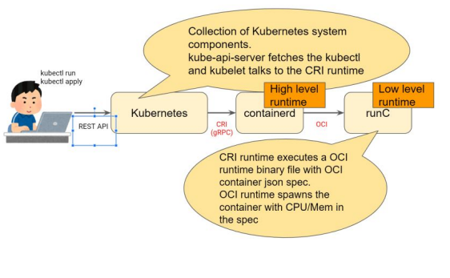

# Docker Tidak Digunakan Lagi di Kubernetes. Bagaimana dengan Podman?

## Docker Tidak Digunakan Lagi di Kubernetes
Yang dimaksud disini adalah bahwa Docker tidak mendukung Kubernetes Runtime API disebut CRI (Container Runtime Interface).
Orang-orang Kubernetes telah menggunakan bridge service yang disebut "dockershim". Ini mengubah Docker API dan CRI, tetapi tidak lagi disediakan dari sisi Kubernetes dalam beberapa rilis minor. 
Singkatnya: Desain Docker tidak sempurna digunakan saat dijalankan di Kubernetes

## Kubernetes
Kubernetes adalah alat infra orkestrasi yang mengelompokkan banyak sumber daya komputasi yang berbeda seperti mesin virtual / fisik dan membuatnya terlihat seperti sumber daya komputasi yang sangat besar untuk dijalankan dan dibagikan aplikasi Anda dengan orang lain.
Dalam arsitektur ini, Docker, atau runtime container, hanya digunakan untuk menjalankan aplikasi tersebut di host sebenarnya dengan dijadwalkan oleh bidang kontrol Kubernetes

## Kubernetes cluster

Setiap node Kubernetes berbicara dengan bidang kontrol. kubelet pada setiap node mengambil metadata dan menjalankan CRI untuk menjalankan create / delete container pada node.

## Tetapi mengapa Docker tidak digunakan lagi?
Memiliki lebih banyak fitur sementara Anda tidak pernah menggunakannya, itu sendiri dapat menjadi risiko keamanan. Semakin sedikit fitur yang Anda miliki, semakin kecil permukaan serangannya.

Redbox; apa yang kubernetes butuhkan

## CRI Runtimes
### Containerd 
Containerd sebenarnya digunakan di dalam Docker untuk melakukan semua pekerjaan "runtime". Mereka menyediakan CRI dan itu 100% apa yang disediakan Docker juga. containerd adalah 100% open source sehingga Anda dapat melihat dokumen di GitHub dan bahkan berkontribusi juga.

### CRI-O 
Terutama dikembangkan oleh orang-orang Red Hat, sekarang digunakan di Red Hat OpenShift. Ya, mereka tidak lagi bergantung pada Docker. Menariknya, RHEL 7 juga tidak secara resmi mendukung Docker. Sebagai gantinya, mereka menyediakan Podman, Buildah, dan CRI-O untuk lingkungan container.
Kekuatan CRI-O adalah minimalisnya. Mereka adalah runtime CRI murni sehingga CRI-O tidak memiliki apa pun yang tidak diperlukan CRI. Akan lebih sulit untuk bermigrasi dari Docker ke CRI-O karena itu, ia masih menyediakan apa yang Anda butuhkan untuk menjalankan aplikasi di Kubernetes.

Cara kerja container runtime di Kubernetes

### OCI Runtimes 
Runtime OCI bertanggung jawab untuk menelurkan container menggunakan panggilan sistem kernel Linux seperti cgroups dan namespace.
    -	runc 
    -	gvisor

### runC 
runC memunculkan container setelah CRI menjalankan biner dengan memanggil panggilan sistem Linux. Itu menunjukkan runC bergantung pada kernel yang dijalankan di mesin Linux.
Ini juga menyiratkan bahwa jika pernah menemukan kerentanan runC yang mengambil hak akses root dari host, aplikasi dalam container juga dapat melakukannya.
Seorang peretas yang buruk dapat mengambil root dan mesin host. Segalanya pasti akan menjadi buruk. Ini adalah salah satu alasan mengapa harus terus mengupdate Docker (atau runtime container lainnya) juga, bukan hanya aplikasi dalam container.

## CRI dan runC

## gVisor
gVisor adalah runtime OCI yang awalnya dibuat oleh orang-orang Google. Ini sebenarnya berjalan di infrastruktur mereka untuk menjalankan layanan Cloud mereka seperti Google Cloud Run, Google App Engine (generasi ke-2), dan Google Cloud Functions dan lainnya.
gVisor memiliki lapisan "kernel tamu" yang berarti aplikasi dalam container tidak dapat langsung menyentuh lapisan kernel host. Bahkan jika mereka berpikir demikian, mereka hanya menyentuh kernel tamu gVisor.
Perbedaan penting dari runC adalah sebagai berikut.
    •	Performa lebih buruk
    •	Lapisan kernel Linux tidak 100% kompatibel
    •	Tidak didukung secara default

## Podman
Podman adalah mesin kontainer tanpa daemon untuk mengembangkan, mengelola, dan menjalankan Kontainer OCI di Sistem GNU/Linux. Kontainer dapat dijalankan sebagai root atau dalam mode tanpa root. 
Sederhananya: `alias docker = podman`. 
Dan jalankan opsi perintah seperti menjalankan docker.

Cukuplah untuk mengatakan bahwa ada beberapa alasan mengapa pengguna Docker khawatir tentang pendekatan ini saat penggunaan meningkat :
    •	Satu proses bisa menjadi satu titik kegagalan.
    •	Proses ini memiliki semua proses anak (wadah yang berjalan).
    •	Jika terjadi kegagalan, maka ada orphaned processes.
    •	Membangun kontainer menyebabkan kerentanan keamanan.
    •	Semua operasi Docker harus dilakukan oleh pengguna (atau pengguna) dengan otoritas root penuh yang sama.

### Karakteristik Podman
    -	run interface 
    -	can using containerd or cri-o 
    -	using OCI(open container initiative) images
    -	run on rootless from https://opensource.com/article/19/2/  how-does-rootless-podman-work 
    -	need config for container network and volumes 
    -	podman-compose 
    -	Yaml generator

## Podman dan container images
Saat pertama kali mengetik images podman, Anda mungkin terkejut karena tidak melihat images Docker yang sudah Anda tarik ke bawah.
Ini karena repositori lokal Podman ada di / var / lib / containers, bukan / var / lib / docker. Ini bukan perubahan sembarangan; struktur penyimpanan baru ini berdasarkan standar Open Containers Initiative (OCI).

## Buildah
Buildah (dinamai untuk kesenangan karena aksen Boston Dan Walsh saat mengucapkan "builder") cocok dengan kriteria ini.
- builder container images 
Namun, jika kita ingin menggunakan cluster Kubernetes yang sama untuk melakukan build, seperti dalam kasus cluster OpenShift, maka kita memerlukan alat baru untuk melakukan build yang tidak memerlukan daemon Docker dan selanjutnya mengharuskan Docker diinstal. Alat seperti itu, berdasarkan proyek kontainer / penyimpanan dan kontainer / image, juga akan menghilangkan risiko keamanan dari soket daemon Docker yang terbuka selama pembuatan, yang mengkhawatirkan banyak pengguna.

Catatan Buildah
Ada beberapa hal tambahan yang perlu dipahami praktisi tentang Buildah:
1.	Memungkinkan kontrol yang lebih baik untuk membuat lapisan image. Ini adalah fitur yang sudah lama diminta oleh banyak pengguna container. Melakukan banyak perubahan ke satu lapisan diinginkan.
2.	Perintah run buildah tidak sama dengan perintah run Podman. Karena Buildah adalah untuk membuat image, perintah run pada dasarnya sama dengan perintah Dockerfile RUN. Buildah run adalah untuk menjalankan perintah tertentu untuk membantu membangun image container, misalnya, buildah run dnf -y install nginx.
3.	Buildah dapat membangun image dari awal, yaitu image yang tidak memiliki apa pun di dalamnya. Tidak ada. Faktanya, melihat penyimpanan kontainer yang dibuat sebagai hasil dari perintah buildah dari awal menghasilkan direktori kosong. Ini berguna untuk membuat image yang sangat ringan yang hanya berisi paket yang diperlukan untuk menjalankan aplikasi Anda.

## Buildah Build dari awal

## Kesimpulan
Podman dan Buildah memecahkan masalah runtime Kubernetes dengan CRI-O dan runC. Ini memungkinkan operator untuk memeriksa container dan image dengan perintah yang biasa mereka gunakan. Dan itu juga memberi pengembang alat yang sama. Jadi pengguna Docker, pengembang, atau operator, dapat pindah ke Podman, melakukan semua tugas menyenangkan yang mereka kenal dari menggunakan Docker, dan melakukan lebih banyak lagi.